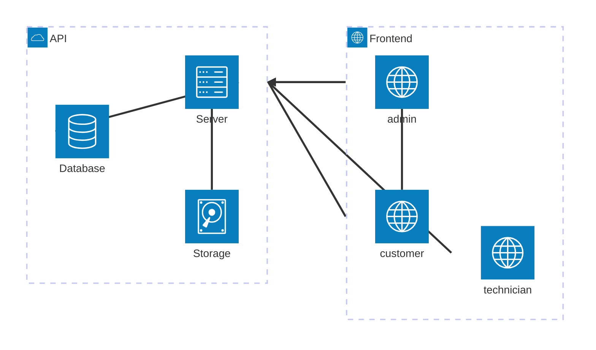

```mermaid
architecture-beta
    group front(internet)[Frontend]

    service customer(internet)[customer] in front
    service technician(internet)[technician] in front
    service admin(internet)[admin] in front

    customer:T -- B:admin

    group api(cloud)[API]

    service db(database)[Database] in api
    service disk1(disk)[Storage] in api
    service server(server)[Server] in api

    db:L -- R:server
    disk1:T -- B:server

    customer{group}:L --> R:server{group}
    technician{group}:L --> R:server{group}
    admin{group}:L --> R:server{group}

```