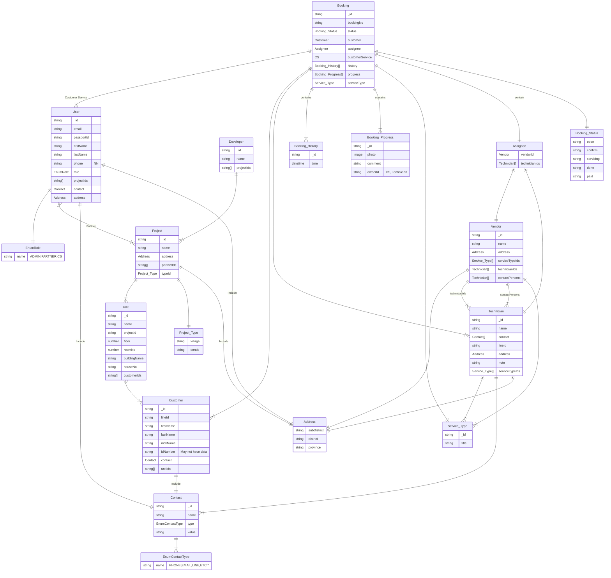

```mermaid
erDiagram


    User ||--|| EnumRole : ""
    User }|--|{ Project : "Partner"
    User ||--|| Contact : "Include"
    User ||--|| Address : "Include"
    User {
      string _id
      string email
      string passportId
      string firstName
      string lastName
      string phone "NN"
      EnumRole role
      string[] projectIds
      Contact contact
      Address address
    }


  
    Contact ||--|{ EnumContactType : ""
    Contact {
      string _id
      string name
      EnumContactType type
      string value
    }

    EnumContactType {
      string name "PHONE,EMAIL,LINE,ETC.*"
    }


    EnumRole {
      string name "ADMIN,PARTNER,CS"
    }

    Address {
      string subDistrict
      string district
      string province
    }


    Developer ||--|{ Project : ""
    Developer {
      string _id
      string name
      string[] projectIds
    }


    Project ||--|{ Unit : ""
    Project ||--|| Project_Type : ""
    Project ||--|| Address : "Include"
    Project {
      string _id
      string name
      Address address 
      string[] partnerIds
      Project_Type typeId
    }

    Project_Type {
      string village
      string condo
    }


    Unit }|--|{ Customer : ""

    Unit {
      string _id
      string name
      string projectId
      number floor
      number roomNo
      string buildingName

      string houseNo
      string[] customerIds
    }

    Customer ||--|| Contact : "Include"
    Customer {
      string _id
      string lineId
      string firstName
      string lastName
      string nickName
      string idNumber "May not have data"
      Contact contact
      string[] unitIds
    }

    Vendor ||--|| Address : ""
    Vendor ||--|{ Technician : "technicianIds"
    Vendor ||--|{ Technician : "contactPersons"
    Vendor ||--|{ Service_Type : ""

    Vendor {
      string _id
      string name
      Address address
      Service_Type[] serviceTypeIds
      Technician[] technicianIds
      Technician[] contactPersons
    }

    Technician ||--|{ Service_Type : ""
    Technician ||--|{ Contact : ""
    Technician ||--|| Address : ""
    Technician {
      string _id
      string name
      Contact[] contact
      string lineId
      Address address
      string note
      Service_Type[] serviceTypeIds
      
    }


    Service_Type {
      string _id
      string title
    }

    Assignee ||--|| Vendor : ""
    Assignee ||--|| Technician : ""

    Assignee {
      Vendor vendorId
      Technician[] technicianIds
    }

    Booking ||--|{ User : "Customer Service"
    Booking ||--|{ Customer : ""
    Booking ||--|{ Technician : ""
    Booking ||--|{ Booking_History : "contains"
    Booking ||--|{ Booking_Progress : "contains"
    Booking ||--|| Service_Type : ""
    Booking ||--|| Assignee : "contain"
    Booking ||--|| Booking_Status : ""
    
    Booking {
      string _id
      string bookingNo
      Booking_Status status
      Customer customer
      Assignee assignee
      CS customerService
      Booking_History[] history
      Booking_Progress[] progress
      Service_Type serviceType
    }

    Booking_Status {
      string open
      string confirm
      string servicing
      string done
      string paid
    }
    
    Booking_History {
      string _id
      datetime time
    }

    Booking_Progress {
      string _id
      Image photo
      string comment
      string ownerId "CS, Technician"
    }

```
