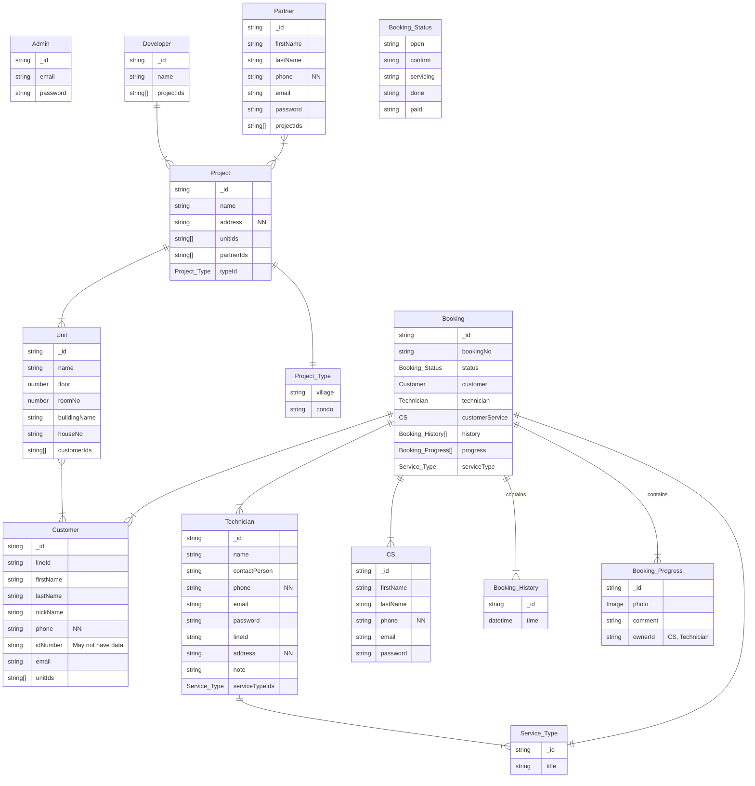

```mermaid
erDiagram

    Admin {
      string _id
      string email
      string password
    }

    CS {
      string _id
      string firstName
      string lastName
      string phone "NN"
      string email
      string password
    }

    Developer ||--|{ Project : ""
    Developer {
      string _id
      string name
      string[] projectIds
    }

    Partner }|--|{ Project : ""
    Partner {
      string _id
      string firstName
      string lastName
      string phone "NN"
      string email
      string password
      string[] projectIds
    }

    Project ||--|{ Unit : ""
    Project ||--|| Project_Type : ""
    Project {
      string _id
      string name
      string address "NN"
      string[] unitIds
      string[] partnerIds
      Project_Type typeId
    }

    Project_Type {
      string village
      string condo
    }


    Unit }|--|{ Customer : ""

    Unit {
      string _id
      string name

      number floor
      number roomNo
      string buildingName

      string houseNo
      string[] customerIds
    }

    Customer {
      string _id
      string lineId
      string firstName
      string lastName
      string nickName
      string phone "NN"
      string idNumber "May not have data"
      string email
      string[] unitIds
    }

    Technician ||--|{ Service_Type : ""
    Technician {
      string _id
      string name
      string contactPerson
      string phone "NN"
      string email
      string password
      string lineId
      string address "NN"
      string note
      Service_Type serviceTypeIds
    }


    Service_Type {
      string _id
      string title
    }

    Booking ||--|{ Customer : ""
    Booking ||--|{ Technician : ""
    Booking ||--|{ CS : ""
    Booking ||--|{ Booking_History : "contains"
    Booking ||--|{ Booking_Progress : "contains"
    Booking ||--|| Service_Type : ""

    Booking {
      string _id
      string bookingNo
      Booking_Status status
      Customer customer
      Technician technician
      CS customerService
      Booking_History[] history
      Booking_Progress[] progress
      Service_Type serviceType
    }

    Booking_Status {
      string open
      string confirm
      string servicing
      string done
      string paid
    }
    
    Booking_History {
      string _id
      datetime time
    }

    Booking_Progress {
      string _id
      Image photo
      string comment
      string ownerId "CS, Technician"
    }


```
